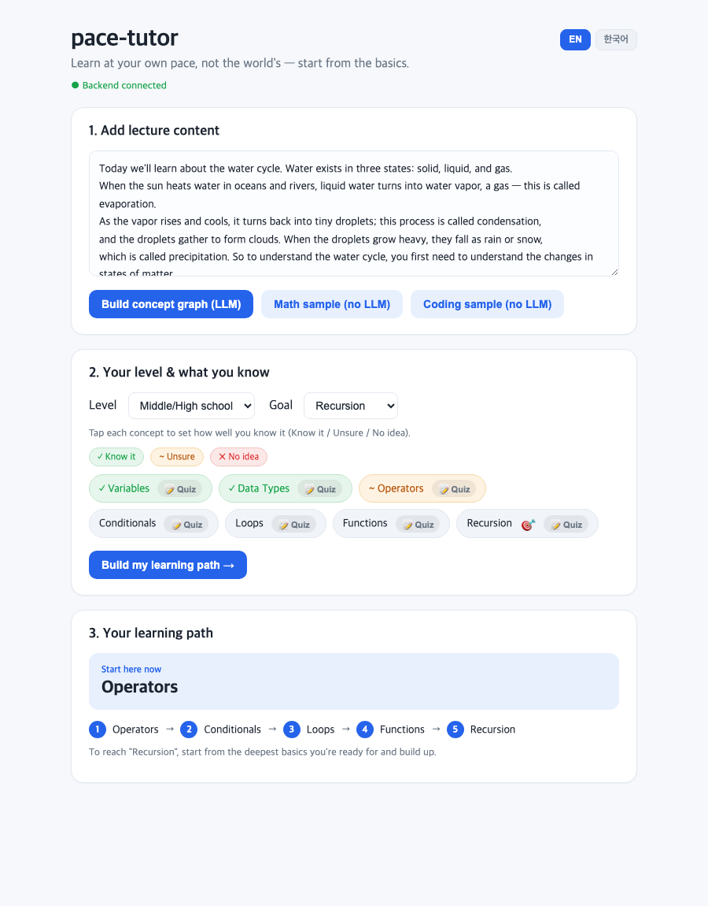

# pace-tutor

**세상의 진도 말고, 자기 속도로 — 기본부터 다시.**

강의(영상·오디오·PDF·텍스트)를 넣으면 pace-tutor가 개념을 파악하고, 당신이 아는 것을
점검한 뒤 **개인 맞춤 자기속도 학습경로**를 만듭니다. 강의가 *당연하게 전제한* 선수개념까지
거슬러 올라가 **진짜 막힌 지점**을 찾아줍니다.

> 왜? 이차방정식에서 막힌 중3 학생은 이차방정식을 못하는 게 아니라, 강의에 안 나온
> 초등 분수 개념이 비어 있는 경우가 많습니다. pace-tutor는 그걸 찾아 거기서 시작합니다.

**모든 과목**(수학·과학·코딩 등) 지원, **영어 우선 + 한국어 토글**, **로컬 실행**(클라우드·계정 불필요).

[English README →](README.md)



---

## 🚀 5분 만에 체험하기

### 방법 A — 앱 다운로드 (설치 불필요, 추천)

1. **[Releases](https://github.com/yuneunmi814-cmyk/pace-tutor/releases)** 에서 OS에 맞게 받기:
   - **macOS**: `pace-tutor_*_aarch64.dmg`
   - **Windows**: `pace-tutor_*_x64-setup.exe`
   - **Linux**: `pace-tutor_*_amd64.AppImage` (또는 `.deb` / `.rpm`)
2. 실행 (첫 실행은 엔진 부팅에 ~10초)
3. **“Coding sample”** 또는 **“Math sample”** 클릭 → 아는 개념 몇 개 표시 →
   **“Build my learning path”** → 어디서 시작할지 바로 나옵니다. ✅

샘플은 **아무것도 더 설치할 필요 없이** 동작합니다. *내 강의*(영상/PDF/텍스트)를 분석하려면
[Ollama](https://ollama.com) 설치 후 `ollama pull llama3.1:8b` 만 하면 됩니다(로컬에서 사용).

### 방법 B — 소스로 실행 (개발자용)

**Python 3.11+** 와 **Node 18+** 필요.

```bash
git clone https://github.com/yuneunmi814-cmyk/pace-tutor.git
cd pace-tutor

# 1) 백엔드 (터미널 1)
python3 -m venv .venv && .venv/bin/pip install -r requirements.txt
.venv/bin/python -m sidecar.server          # → http://127.0.0.1:8008

# 2) 프론트엔드 (터미널 2)
cd ui && npm install && npm run dev          # → http://localhost:5173 열기
```

브라우저에서 샘플 클릭 — 위와 같은 3단계입니다.

> API 키·가입 없음. Ollama는 *내 강의*를 넣을 때만 필요하고, 내장 샘플·퀴즈는 없어도 됩니다.

---

## 어떻게 동작하나

```
영상 / 오디오 / PDF / 텍스트
        │   '내 자료'에서 개념 추출 (+ 기초→고급 정렬)
        ▼
   개념 그래프 ──► 진단(퀴즈/자기평가) ──► 자기속도 학습경로
        ▲                                  "지금 시작할 것" + 단계별
        └── 커리큘럼 백본(선택): 강의가 전제하고 안 가르친 기초를 끌어와
            진짜 막힌 곳까지 역추적
```

학습경로는 LLM이 아니라 검증된 두 알고리즘이 만듭니다: 숙달도는 **Bayesian Knowledge
Tracing**, 순서는 **선수개념 역추적**. LLM은 개념을 뽑고 정렬만, 신뢰할 수 있는 구조는 백본이.

빌드·배포는 [docs/DISTRIBUTION.md](docs/DISTRIBUTION.md), 설계 근거는 `*-reference.md` 참고.

## 폴더 구조

```
engine/    진단 + 추천 (numpy) — 과목·언어 무관
ingest/    자료 → 개념 그래프: 로더, STT, LLM 추출, 백본
sidecar/   FastAPI 서버(:8008) — engine+ingest 래핑 (앱에 번들)
ui/        Vite+React 데스크톱 UI (라이트테마, 영어우선) + Tauri 셸
data/      커리큘럼 백본 (수학/과학/코딩, EN+KO)
```

## 기여 / 확장

과목 추가는 **데이터만 넣으면 됩니다** — `data/backbone_<과목>_<언어>.json` 에 개념·선수관계·
별칭·(선택)퀴즈를 적으면 끝. 검증:

```bash
.venv/bin/python verify_scenario.py        # 핵심 진단 + 역추적
.venv/bin/python verify_backbone.py        # 백본 (결정적)
.venv/bin/python verify_pull_prereqs.py    # 자료 아래 기초 끌어오기
```
