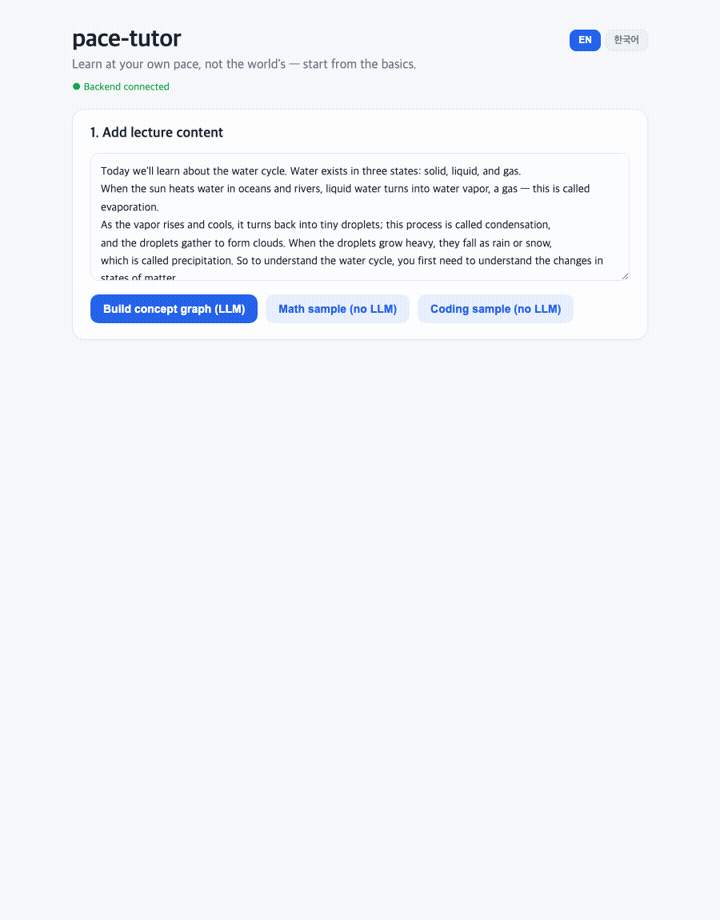

# pace-tutor

[](https://github.com/yuneunmi814-cmyk/pace-tutor/releases)


**Learn at your own pace, not the world's — start from the basics.**

Paste any lecture (video, audio, PDF, or text) and pace-tutor figures out the concepts,
checks what you already know, and builds a **personalized, self-paced learning path** —
tracing back through the prerequisites a lecture *assumes* until it finds the real gap.

> Why? A 9th-grader stuck on quadratics often isn't failing quadratics — they're missing
> an elementary fraction concept the lecture never mentions. pace-tutor finds that and starts there.

Works for **any subject** (math, science, programming, …), **English-first** with a Korean
toggle, and runs **locally** (no cloud, no account).

[한국어 README →](README.ko.md)



---

## 🚀 Try it in 5 minutes

### Option A — Download the app (no setup, recommended)

1. Go to **[Releases](https://github.com/yuneunmi814-cmyk/pace-tutor/releases)** and download for your OS:
   - **macOS**: `pace-tutor_*_aarch64.dmg`
   - **Windows**: `pace-tutor_*_x64-setup.exe`
   - **Linux**: `pace-tutor_*_amd64.AppImage` (or `.deb` / `.rpm`)
2. Open it. (First launch takes ~10s while the engine boots.)
3. Click **“Coding sample”** or **“Math sample”** → mark a few concepts you know →
   **“Build my learning path.”** That's it — you'll see where to start. ✅

The samples need **nothing else installed**. To analyze *your own* lecture (video/PDF/text),
install [Ollama](https://ollama.com) and run `ollama pull llama3.1:8b` (the app uses it locally).

### Option B — Run from source (for developers)

Requires **Python 3.11+** and **Node 18+**.

```bash
git clone https://github.com/yuneunmi814-cmyk/pace-tutor.git
cd pace-tutor

# 1) Backend (one terminal)
python3 -m venv .venv && .venv/bin/pip install -r requirements.txt
.venv/bin/python -m sidecar.server          # → http://127.0.0.1:8008

# 2) Frontend (another terminal)
cd ui && npm install && npm run dev          # → open http://localhost:5173
```

Then click a sample in the browser — same 3 steps as above.

> No API keys, no sign-up. Ollama is only needed to ingest *your own* lectures; the
> built-in samples and quizzes work without it.

---

## How it works

```
video / audio / PDF / text
        │   concepts extracted from YOUR material (+ ordered basic→advanced)
        ▼
   concept graph ──► diagnosis (quiz or self-rating) ──► self-paced learning path
        ▲                                                 "start here now" + ordered steps
        └── curriculum backbone (optional): pulls in foundations the lecture assumed
            but never taught — so you can be routed all the way down to the real gap
```

The path comes from two proven algorithms (not the LLM): **Bayesian Knowledge Tracing**
for mastery and **prerequisite back-tracking** for ordering. The LLM only names the
concepts and orders them; reliable structure comes from the curriculum backbone.

More detail: [docs/DISTRIBUTION.md](docs/DISTRIBUTION.md) (building/releasing),
and the design blueprints (`*-reference.md`).

## Project layout

```
engine/    diagnosis + recommendation (numpy) — subject/language-agnostic
ingest/    any input → concept graph: loaders, STT, LLM extraction, backbone
sidecar/   FastAPI server (:8008) wrapping engine + ingest (bundled into the app)
ui/        Vite + React desktop UI (light theme, English-first) + Tauri shell
data/      curriculum backbones (math / science / programming, EN + KO)
```

## Contributing / extending

Adding a subject is **just data** — drop a `data/backbone_<subject>_<lang>.json` with
concepts, prerequisites, aliases, and (optional) quiz questions. No code, no wiring.

👉 **[CONTRIBUTING.md](CONTRIBUTING.md)** has a copy-paste template and a ~5-minute first PR.

```bash
.venv/bin/python verify_scenario.py        # core diagnosis + back-tracking
.venv/bin/python verify_backbone.py        # curriculum backbone (deterministic)
.venv/bin/python verify_pull_prereqs.py    # pull below-material foundations
# (see all verify_*.py / eval_*.py)
```

## License

See repository. Built with [Tauri](https://tauri.app), [faster-whisper](https://github.com/SYSTRAN/faster-whisper),
and [Ollama](https://ollama.com).
